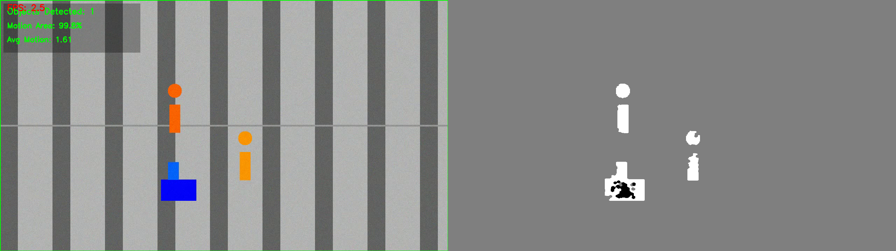
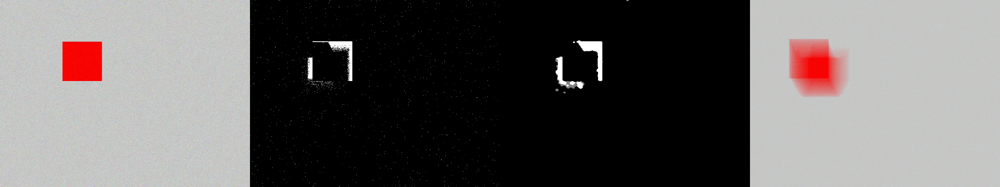
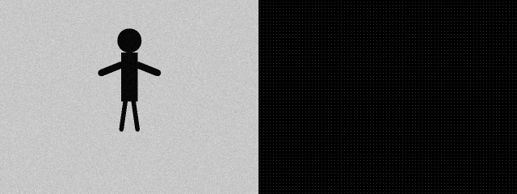
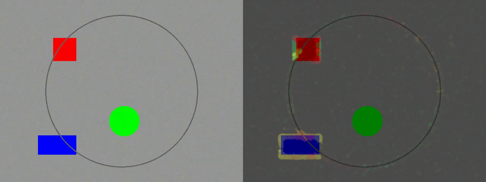
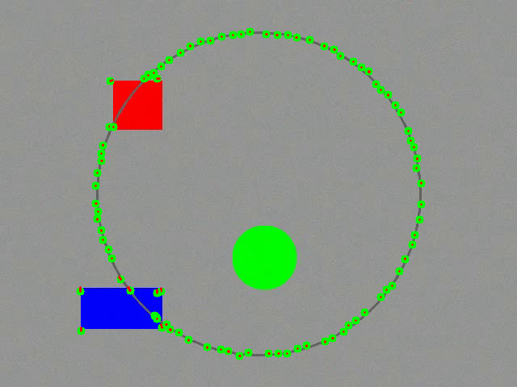
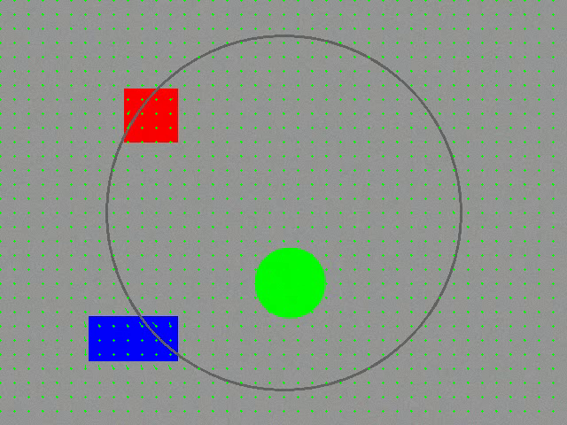

<div align="center">

# Object Detection and Motion Analysis

**Görüntü İşleme Deney 9 - Nesne Tespiti ve Hareket Analizi**


Hareketli nesneleri algılayan, optik akış ile hareket yönünü analiz eden ve HOG özellikleriyle görüntü temsili çıkaran Python/OpenCV laboratuvar projesi.

</div>

---

## Proje Özeti

Bu proje, depo izleme senaryosu üzerinden klasik görüntü işleme algoritmalarını bir araya getirir. Uygulama; arka plan çıkarma, MOG2, HOG tanımlayıcısı, Lucas-Kanade seyrek optik akış ve Farneback yoğun optik akış yöntemlerini örneklerle gösterir.

Temel amaç, video karelerinde hareketli bölgeleri bulmak, nesne sayımı yapmak ve hareketin yön/şiddet bilgisini görsel olarak analiz etmektir.

## Görsel Çıktılar

| Entegre Depo İzleme | MOG2 Nesne Maskesi |
|---|---|
|  |  |

| HOG Özellikleri | HSV Optik Akış |
|---|---|
|  |  |

| Lucas-Kanade | Farneback |
|---|---|
|  |  |

## Kullanılan Yöntemler

| Modül | Algoritma | Amaç |
|---|---|---|
| Background Subtraction | Frame difference | Statik arka plandan hareketli bölgeleri ayırma |
| MOG2 | Gaussian Mixture Model | Işık değişimi ve tekrar eden hareketlere daha dayanıklı ön plan çıkarma |
| HOG | Histogram of Oriented Gradients | Kenar/yön histogramları ile nesne özelliği çıkarma |
| Lucas-Kanade | Sparse optical flow | Seçilen köşe noktalarını hızlı takip etme |
| Farneback | Dense optical flow | Tüm piksel alanında yoğun hareket vektörü üretme |
| Integrated System | Birleşik pipeline | Depo sahnesinde nesne tespiti, maskeleme ve istatistik üretme |

## Klasör Yapısı

```text
image_processing_lab/
├── assets/readme/                  # README için seçilmiş görseller
├── examples/
│   ├── 01_background_subtraction.py
│   ├── 02_hog_descriptor.py
│   ├── 03_optical_flow.py
│   └── 04_integrated_system.py
├── src/
│   ├── algorithms/
│   │   ├── background_subtraction.py
│   │   ├── hog_descriptor.py
│   │   └── optical_flow.py
│   └── utils/
│       └── image_handler.py
├── config.py
├── main.py
├── requirements.txt
├── SETUP.md
└── QUICK_START.md
```

`output/` klasörü çalışma sırasında üretilen görsel ve videolar için kullanılır. Büyük video/frame çıktıları repo kalabalığı yapmaması için `.gitignore` kapsamındadır.

## Kurulum

```bash
git clone https://github.com/Yavuz0707/Object-Detection-and-Motion-Analysis.git
cd Object-Detection-and-Motion-Analysis

python -m venv venv
venv\Scripts\activate

pip install --upgrade pip
pip install -r requirements.txt
```

macOS/Linux için sanal ortam aktivasyonu:

```bash
source venv/bin/activate
```

## Çalıştırma

Ana menüyü açmak için:

```bash
python main.py
```

Örnekleri doğrudan çalıştırmak için:

```bash
python examples/01_background_subtraction.py
python examples/02_hog_descriptor.py
python examples/03_optical_flow.py
python examples/04_integrated_system.py
```

## Kısa Kod Örnekleri

### MOG2 ile hareket maskesi

```python
from src.algorithms.background_subtraction import MOG2BackgroundSubtractor

mog2 = MOG2BackgroundSubtractor(history=500, var_threshold=16)
mask = mog2.process_frame(frame)
```

### HOG özellik çıkarımı

```python
from src.algorithms.hog_descriptor import HOGDescriptor

hog = HOGDescriptor(cell_size=8, block_size=2, nbins=9)
features = hog.extract_features(image)
```

### Farneback optik akış

```python
from src.algorithms.optical_flow import OpticalFlowFarneback

flow_model = OpticalFlowFarneback(num_levels=3, window_size=15)
visualization, flow = flow_model.process_frame(frame)
```

## Örnek Programlar

| Komut | İçerik |
|---|---|
| `python examples/01_background_subtraction.py` | Klasik arka plan çıkarma, MOG2 ve eşik karşılaştırması |
| `python examples/02_hog_descriptor.py` | HOG özellikleri, hücre boyutu karşılaştırması ve normalizasyon etkisi |
| `python examples/03_optical_flow.py` | Lucas-Kanade, Farneback, HSV akış görselleştirmesi |
| `python examples/04_integrated_system.py` | Depo izleme demosu, nesne sayımı ve hareket istatistikleri |

## Performans Notları

| Yöntem | Hız | Kapsama | Uygun Kullanım |
|---|---:|---:|---|
| Klasik background subtraction | Çok hızlı | Orta | Basit/sabit kamera senaryoları |
| MOG2 | Hızlı | Yüksek | Değişken ışık ve tekrarlı hareket |
| Lucas-Kanade | Çok hızlı | Seyrek | Gerçek zamanlı nokta takibi |
| Farneback | Daha maliyetli | Yoğun | Detaylı hareket haritası |
| HOG | Orta | Özellik tabanlı | Nesne/insan temsili çıkarımı |

## Yapılandırma

Algoritma parametreleri [config.py](config.py) içinden değiştirilebilir:

- `BACKGROUND_SUBTRACTION_CONFIG`: eşik, morfolojik işlem ve MOG2 ayarları
- `HOG_CONFIG`: hücre boyutu, blok boyutu ve yön histogramı sayısı
- `OPTICAL_FLOW_CONFIG`: Lucas-Kanade ve Farneback parametreleri
- `VIDEO_CONFIG`: FPS, çözünürlük ve video süresi
- `WAREHOUSE_CONFIG`: depo simülasyonu ve algılama eşikleri

## Kaynaklar

- OpenCV Documentation: https://docs.opencv.org/
- scikit-image Documentation: https://scikit-image.org/
- Dalal & Triggs, Histograms of Oriented Gradients for Human Detection
- Lucas & Kanade, An Iterative Image Registration Technique
- Farnebäck, Two-Frame Motion Estimation Based on Polynomial Expansion

## Lisans

Bu proje eğitim amaçlı hazırlanmıştır.
